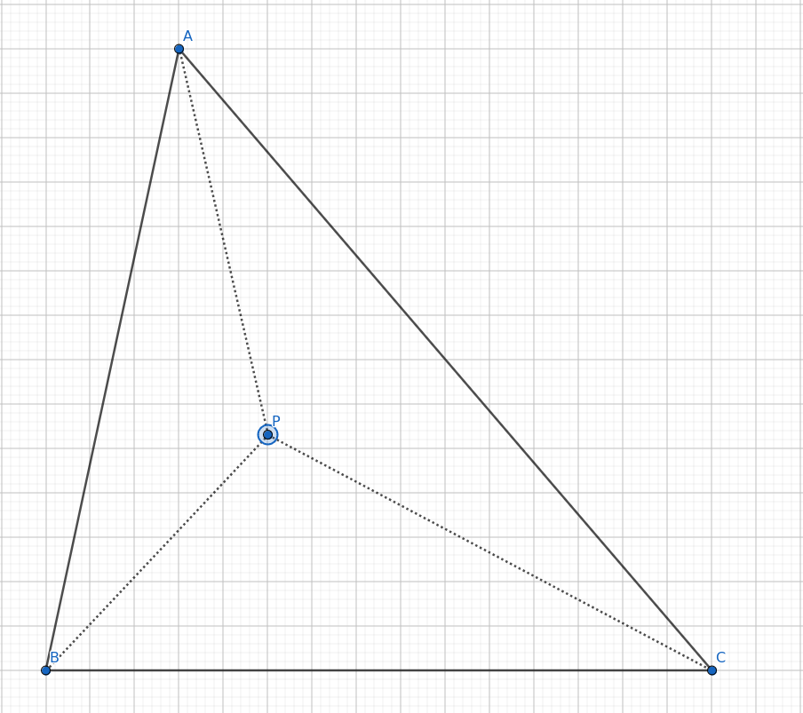
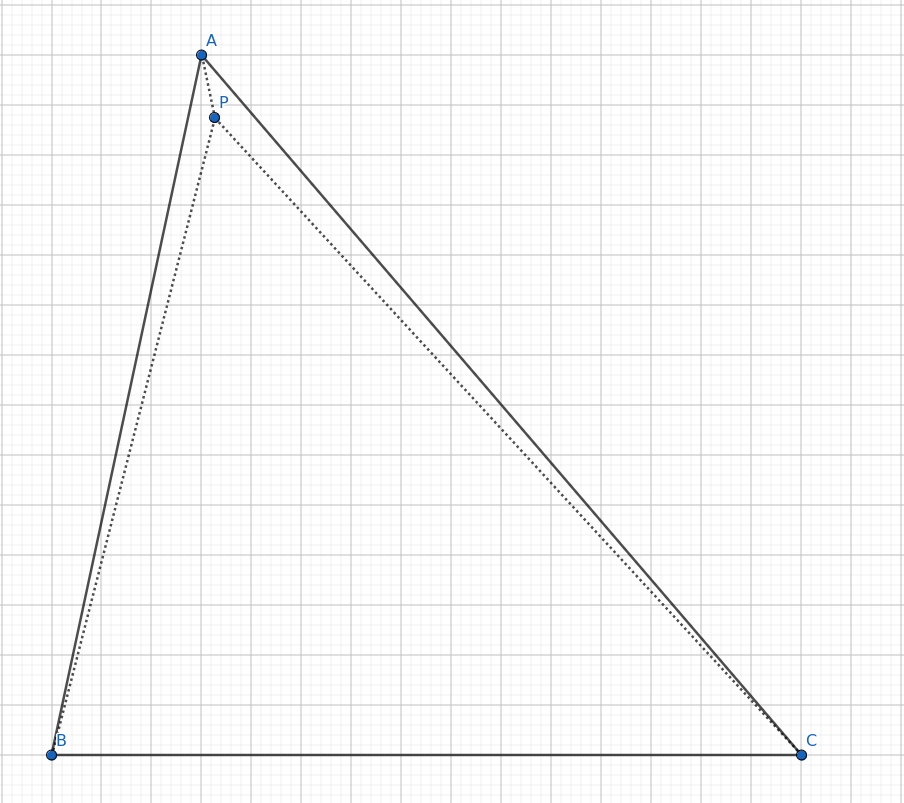

## General ressources & definitions

## Time for some geometry
We are going to solve this problem using geometry and pain. 
For this, we are going to need a few concepts, which you skip if you're already familiar with. The goal is to use **vectors** to determine the **barycentric coordinates** of a point P as related to three **vertices** A, B and C.

## Definitions

### 1. Euclidean Vector
- [Eclidean vectors](https://en.wikipedia.org/wiki/Euclidean_vector)

Vectors, in geometry, are objects that have a given *lenght* and a *direction*. They can be added and scaled. It's basically the distance going from a point A to a point B in space. Vectors can be many things, but in the current situation, this definition is enough. 

### 2. Vertices
- [Vertices of a triangle](https://mathmonks.com/triangle/vertices-of-a-triangle)
> singular is *vertex*, so a vertex, several vertices

In geometry, a vertex is a point where two straight lines intersect. A triangle being composed of three lines, it possesses three vertices. 

### 3. Barycentric Coordinates

```math
	b = (w1, w2, w3)
```

Given a triangle (or simplex), the barycentric coordinate of a point P is the combinations of three "weights" (w1, w2 and w3). These "weights" are proportionate to the area of subtriangles created by the presence of P.
> a simplex is a triangle or tetrahedron(= a 3D triangle) in any dimension you want (2D, 3D).

Basically, imagine a triangle ABC in which you have a point P. By tracing segments from each vertex to the P, you get three new triangles : ABP, ACP, and BCP. Those new triangles each have an area, which is a proportion of the original triangle ABC ; the proportion of each of these triangle is determined by the barycentric coordinates of P.



Now, here P is in a pretty central location. Its barycentric coordinates should be fairly well distributed, meaning each vertex has a similar "weight" on the position of point P. If we get P very close to A, then we'll get two tiny triangles and big one : 


Meaning that A has a lot of "weight" relative to P, and that the barycentric coordinate element that relate to A must be very high.

> Why the fuck are we talking about weight and mass ? 
In the context of barycentric coordinates, weight or mass has nothing to do with physical mass. They just serve to describe a point's position relative to the vertices of a shape. It's called that because barycentric comes the the greek barus, meaning weight. There's nothing more to it. 
Given a triangle ABC, you can get the barycentric coordinate of any point in the triangle with the following equation (which is called a *convex combination*).

**A few properties of barycentric coordinates**
1. For a point to be inside the triangle, w1, w2 and w3 must be >= 0. If one of them is < 0, it means the point is outside the triangle.
2. w1 + w2 + w3 must be == 1 in order for the point to be inside the triangle

So, if we can decide to place a point P in the triangle using the barycentric coordinates, if we can deduce the barycentric coordinates of an existing point, then we should be able to determine wether P is inside the triangle, or out, which is the entire point of this fuckery.

- [Detect if a given point is inside a triangle](https://www.youtube.com/watch?v=HYAgJN3x4GA) (video)

In order to get the barycentric coordinates of P, we need to apply a formula that I did not invent but that I will explain. It comes from the previous video. 

The barycentric coordinates are defined by two `weight` variables, named `w1` and `w2`, that we can deduce by using four vectors of the triangle that are given to us. 

