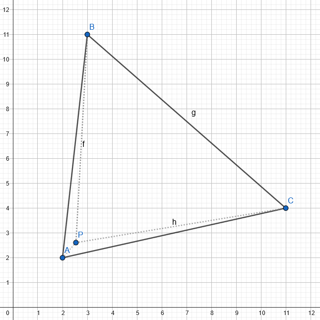

## General resources & definitions

## Time for some geometry
We are going to solve this problem using geometry and pain. 
For this, we are going to need a few concepts, which you skip if you're already familiar with. The goal is to use **vectors** to determine the **barycentric coordinates** of a point P as related to three **vertices** A, B and C.

## Definitions

### 1. Euclidean Vector
- [Euclidean vectors](https://en.wikipedia.org/wiki/Euclidean_vector)

Vectors, in geometry, are objects that have a given *length* and a *direction*. They can be added and scaled. It's basically the distance going from a point A to a point B in space. Vectors can be many things, but in the current situation, this definition is enough. 

We are using vectors because operations using the components of vectors result in *scalar values*, which are practical in this case since we are calculation *proportions*.

### 2. Vertices
- [Vertices of a triangle](https://mathmonks.com/triangle/vertices-of-a-triangle)
> singular is *vertex*, so a vertex, several vertices

In geometry, a vertex is a point where two straight lines intersect. A triangle being composed of three lines, it possesses three vertices. 

### 3. Barycentric Coordinates


Given a triangle (or simplex), the barycentric coordinate of a point P is the combinations of three "weights" (w1, w2 and w3). These "weights" are proportionate to the area of subtriangles created by the presence of P.

So the barycentric coordinates of P can be noted as follows
```math
    bP = (w1, w2, w3)
```
> a simplex is a triangle or tetrahedron(= a 3D triangle) in any dimension you want (2D, 3D).

Basically, imagine a triangle ABC in which you have a point P. The parameters are as follows : A(2, 2),
B(3, 11), C (11, 4), and P(6,6).


By tracing segments from each vertex to the P, you get three new triangles : ABP, ACP, and BCP. Those new triangles each have an area, which is a proportion of the original triangle ABC ; the proportion of each of these triangles is determined by the barycentric coordinates of P.

The barycentric coordinates of P in this example are :

```math
    bP = (0.351, 0.418, 0.230)
```

Now, here P is in a pretty central location. Its barycentric coordinates are fairly well distributed, meaning each vertex has a similar "weight" on the position of point P. 
If we get P very close to A, then we'll get two tiny triangles and a big one : 



And the new barycentric coordinates for P are : 

```math
    bP = (0.054, 0.058, 0.886)
```

We see that moving P near one of the vertex has a big impact on how the barycentric coordinate are spread. The closer P is to one of the vertices, the "heavier" that vertex will be in the barycentric coordinates.

> **Why the fuck are we talking about weight and mass ?**
In the context of barycentric coordinates, weight or mass has nothing to do with physical mass. They just serve to describe a point's position relative to the vertices of a shape. It's called that because barycentric comes from the Greek barus, meaning weight. There's nothing more to it.

**A few properties of barycentric coordinates**
1. For a point to be inside the triangle, w1, w2 and w3 must be >= 0. If one of them is < 0, it means the point is outside the triangle. 
2. For a point to be inside the triangle, w1 + w2 + w3 must be == 1.
3. If one of the coordinates is == 1 and the others are == 0, it means P is on one of the sides of the triangle. 

Now, to the main course. This is where the math come in. In order to get the barycentric coordinates of P, we need to apply a formula that wedid not invent but that we will explain. It comes from the previous video. Bear with me, it's not as bad as it's going to look.

We will be using the vector based formula to get the results we need. 

The formula we are using comes from this video : [Detect if a given point is inside a triangle](https://www.youtube.com/watch?v=HYAgJN3x4GA) (video).

The advantage of that formula is that we are calculating the weight of P in relation to the edges of our triangle, not the vertices, which allows us for more flexibility ; a vertex based approach means that we must be careful about how we orient our vertices, which is annoying and less precise. 

## Goal of the operation
We want to obtain w1 and w2, which will be sufficient to determine whether our P is inside the triangle or not.

w1 is the weight of P in relation to the edge of the triangle opposite of A.
w2 is the weight of P in relation to the edge of the triangle opposite of B.

## Ingredients for the Barycentric coordinates recipe :
- the coordinates of the three vertices of your triangle ; ours are called a, b and c.
- the coordinates of your point `point`.

1. Step 1. Getting the components of the vectors. 

You will need the X and Y components of vectors AC and AB, but also the Y component of AP. Those vectors can be materialized as such :

```
    // Vector AC
    // vABY and vABX are the components of my vector AC.
    Fixed vACY = c.getY() - a.getY(); // represents the vertical distance between A and C
    Fixed vACX = c.getX() - a.getX();  // represents the horizontal distance between A and C

    // Vector AB
    // vABY and vABX are the components of my vector AB.
    Fixed vABY = b.getY() - a.getY();
    Fixed vABX = b.getX() - a.getX();

    // Vector AP
    Fixed vAPY = point.getY() - a.getY();
```

> Fixed is a fixed point number. Here, we are using a custom class, but Fixed could totally be a float.

2. Step 2. The math stuff 

The formula we are using to determine the values of w1 is the following : 

```math
    w1 = (a.getX() \times vACY + vAPY \times vACX - point.getX() \times vACY) \div (vABY \times vACX - vABX \times vACY);
```

we are using the *components* of my vectors AC and AB to obtain w1 and w2. Let's break it down.

We start by determining the dot product of AC and AP :
```math
    result = ((a.getX() \times vACY) + (vAPY \times vACX))
```
Which we then project that result using `point.getX() * vACY`. 

```math
    result = result - point.getX() \times vACY
```
This allows me to determine the relationship between AP and AC. Once that's done, we divide the result by the dot product of AB and AC. This allows me to *normalize* the result. We are using AB and AC because we are calculating P's position in relation to these vectors. 


```math
    w1 = result \div (vABY \times vACX - vABX \times vACY);
```
> **normalizing** means that we are transforming a result to a standard form, in order to make it comparable and consistent. In computer science, it also allows us to deal with much greater values (ie, if we are normalizing everything by a billion, we can more easily manipulate very large number, and in order to get the "normal" result, we just have to multiply by a million at the end of my operations).

We now have w1 ! And since the less unknown, we have, the easier it is to solve something, the formula for w2 is much easier, as we are using w1 :

```math
    w2 = (vAPY - w1 \times vABY) \div vACY;
```

And voilà ! We have successfully calculated w1 and w2. We don't need w3 in this case because :
- if either w1 or w2 is negative, it means P in on the side of one of our edges.
- if w1 + w2 is greater than one, it means P is beyond the side opposite of A.

We could still calculate w3, however, and it would be really simple : 

```math
    w3 = 1 - w1 - w3;
```
Since `w1 + w2 + w3` must equal one in order to have a point inside a triangle, if w3 calculated in this way is negative, it means that the sum of w1 + w2 is greater than one, and that the point cannot be inside the triangle. 


